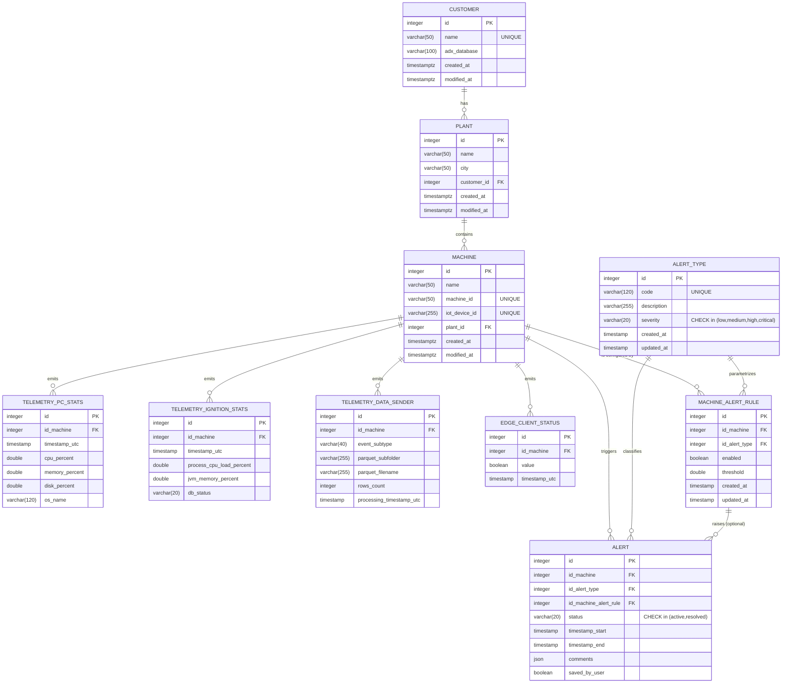
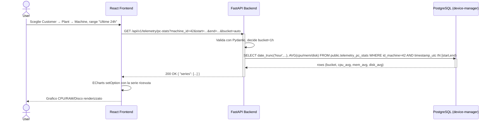
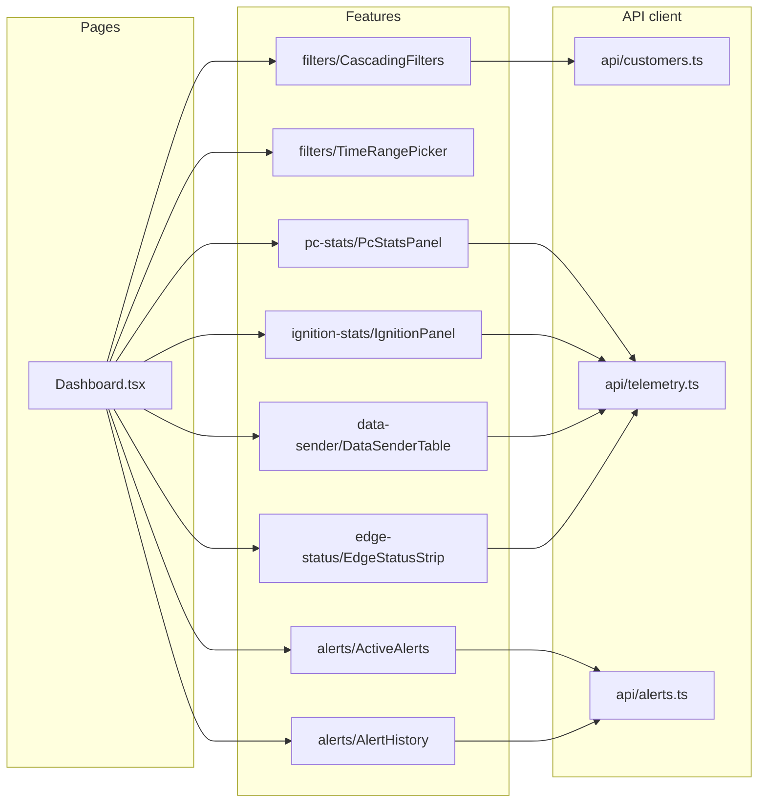

# Diagrammi (ER & UML)

I blocchi Mermaid sotto sono visualizzabili direttamente su GitHub, GitLab, Notion, Obsidian o VS Code con l'estensione Markdown Preview Mermaid Support.

## 1. Diagramma ER (schema effettivo del dump)

> Tabelle `file_excel` e `generated_files` esistono nel dump ma sono fuori dallo scope della dashboard e omesse di proposito.

## 2. Diagramma di sequenza — caricamento pannello PC stats

## 3. Diagramma di flusso — selezione filtri a cascata

```mermaid
flowchart TD
    A[Load dashboard] --> B[GET /customers]
    B --> C{Customer selected?}
    C -- no --> C
    C -- yes --> D[GET /customers/&#123;id&#125;/plants]
    D --> E{Plant selected?}
    E -- no --> E
    E -- yes --> F[GET /plants/&#123;id&#125;/machines]
    F --> G{Machine selected?}
    G -- no --> G
    G -- yes --> H[Read time range from picker]
    H --> I[Parallel fetch:<br/>pc-stats, ignition-stats,<br/>data-sender, edge-status,<br/>alerts/active, alerts/summary]
    I --> J[Render dashboard panels]
```

## 4. Componenti frontend (vista logica)

